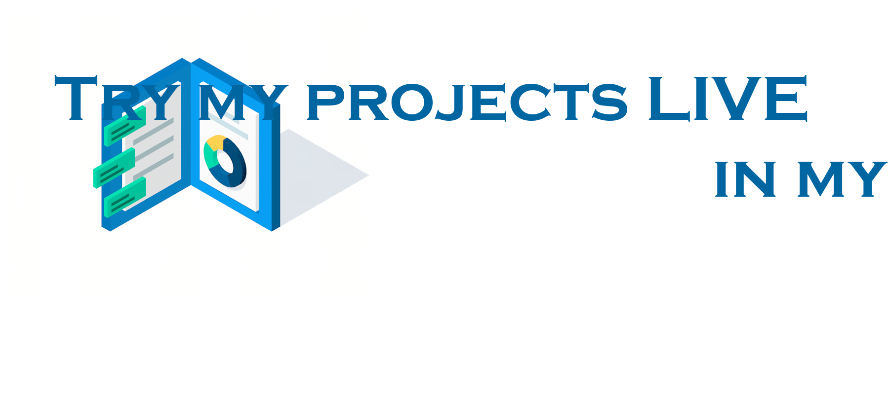

<h3 align="center">Hello! I am</h3>
<h1 align="center"></h1>

- 👨🏽‍💻 I’m currently working on *[AniBout_me](https://github.com/ilievm/AniBout_me)* — An artificial intelligence image recognition tool that uses Image Recognition to return a list of GIFs based on image content.

- 📫 You can reach me by my email — **ilievmyk@gmail.com**

<h3 align="left">Connect with me:</h3>

<h3 align="left">My tech stack:</h3>

                            

&nbsp;

